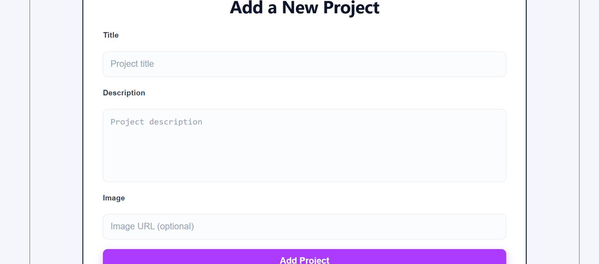
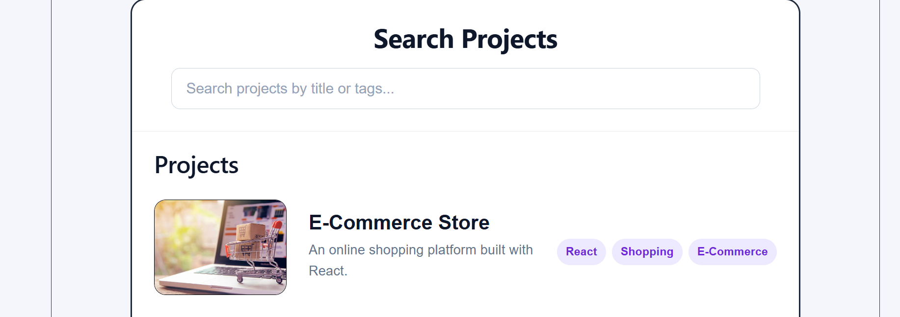

# Portfolio Platform (React SPA)

A responsive Single Page Application (SPA) built with React that showcases projects in a modern portfolio. Users can browse projects, search through them, and dynamically add new ones without refreshing the page.

---

## Features

- View a portfolio of projects
- Add new projects dynamically
- Search projects in real time
- Responsive design for desktop and mobile devices
- Image placeholder for projects without an image URL
- Click project images to view them in a larger modal
- Success message displayed when a project is added
- Smooth hover effects and animations

---

## Technologies Used

- React
- JavaScript 
- CSS
- Vite

---

## Project Structure

```
src/
│
├── assets/
│   ├── ecommerce.jpg
│   ├── task.jpg
│   ├── recipe.jpg
│   └── placeholder.jpg
│
├── components/
│   ├── Header.jsx
│   ├── ProjectCard.jsx
│   ├── ProjectForm.jsx
│   ├── ProjectList.jsx
│   └── SearchBar.jsx
│
├── App.jsx
├── App.css
└── main.jsx
```

---

## Installation

Clone the repository.

```bash
git clone git@github.com:modidi/portfolio-platform.git
```

```bash
npm create vite@latest portfolio-platform -- --template react
```

Navigate into the project folder.

```bash
cd portfolio-platform
```

Install dependencies.

```bash
npm install
```

Start the development server.

```bash
npm run dev
```

Open the application in your browser using the URL provided by Vite (usually http://localhost:5173).

---

## How to Use

### View Projects

The homepage displays a list of available projects.

### Search Projects

Use the search bar to filter projects by title. Results update instantly as you type.

### Add a Project

Complete the form by entering:

- Project title
- Description
- Optional image URL

Click **Add Project** to add it to the portfolio.

If no image URL is provided, a default placeholder image is displayed automatically.

### View Larger Images

Click any project image to open it in a larger modal.

Click outside the image to close the modal.

---

## Responsive Design

The application adapts to different screen sizes by:
- Stacking project cards vertically on smaller devices
- Resizing images appropriately.
- Making the search bar and form input responsive.
- Providing a consistent user experience on desktop, tablet and mobile devices.

---

## Screenshots

### Add Project Form



### Search Projects



---

## Author

**Maureen Mutua**

GitHub: https://github.com/modidi